> Pending local release: see [Store facts and invitation integration](IMPORT-TRIGGER-INTEGRATION.md) for the new import contract, customer preview, tester access and trigger endpoints. Not deployed.

# Architecture

> Live dashboard update: see [the integrated release status](LIVE-DASHBOARD-RELEASE.md). Authenticated saved controls now supersede the earlier sandbox-only status below. Checkout/channel limitations remain explicit.

## Existing platform and target extension

JavaScript / Next.js on Vercel; GitHub source control; EON uses Neon PostgreSQL and Neon Auth. House of EON keeps its own Supabase commerce data. No platform DB migration to Supabase is planned. The connector sends only approved facts; merchant service credentials never cross into EON or a browser.

```mermaid
flowchart LR
  S[Website / Shopify / recovery / future agent] --> C[EON Connect]
  C --> T[EON Trigger]
  T --> V[EON Converse]
  V --> R[EON Rules]
  R --> O[EON Optimize: safe candidates only]
  O --> Q[Versioned expiring quote]
  Q --> A[Atomic acceptance and checkout reservation]
  A --> P[Store connector: exact checkout]
  P --> W[Verified order events]
  W --> D[Funnel and contribution dashboard]
```

| Module | Owns | Must not do |
|---|---|---|
| Trigger | Invitations, eligibility reasons, exclusions, cooldowns | Treat client behavior as authority over commercial data |
| Converse | Intent and clarification, rendered public quote | Generate or see secret floors, authorize a deal |
| Rules | Deterministic safe candidate enumeration; costs, floors, stock, budget, capabilities | Trust a model, hidden identity proxy or browser-supplied cost |
| Optimize | Rank only valid candidates; evidence-backed suggestions | Alter constraints automatically or present a heuristic as probability |
| Connect | Store adapters, channel adapters, verification, normalized facts and checkout | Implement a separate pricing engine for each platform |

`modules/` is the next engine scaffold, exercised by `/pilot` using fictional fixtures. `lib/live/` remains the current production path. Integrate by replacing the live pricing call with a single orchestrator after parity tests, not by running two independent authorities. No new live endpoint exposes private module output.

## Transaction and acceptance boundaries

1. Validate tenant installation, signed session token, server expiry, eligibility and stable experiment arm. Acquire a session row lock; check turn/rate/spend limits.
2. Fetch fresh connector context with bounded timeout and revision. Validate SKU, quantity, currency, shipping, payment, stock and capabilities. Separate external network calls from long-held database locks where possible and recheck revision before commit.
3. Converse produces an allowlisted intent; customer confirms quantity, price basis and requested terms. Rules produces candidates; Optimize ranks them. Persist quote with policy/trigger version, context revision, cart hash, terms, total, economics and expiry. Public response is an explicit field allowlist.
4. Accept with idempotency key: lock quote/session/budget bucket, revalidate active policy and fresh commerce context, reserve full concession liability, consume one-use grant, create checkout attempt/outbox record atomically. Same request returns same attempt; changed body with same key conflicts. No two accepted quotes per session.
5. Worker calls idempotent provider checkout outside transaction. Persist outcome; retry timeouts against the same key. If uncertainty exists, reconcile before releasing budget or issuing another checkout. Provider enforces exact signed terms, payment method and non-stacking.
6. Authenticate/dedupe webhooks, confirm order currency/amount/terms and permitted state transition. Mark revenue only on verified paid. Refunded/cancelled orders adjust net revenue and attribution; keep immutable original events.

## Interfaces and channels

Store adapter: capabilities, catalog import, fresh commerce context, exact checkout, authenticated order events. Existing `lib/commerce` custom/Shopify contracts remain the production baseline. `modules/connect` describes future extension operations; it does not imply new provider support.

Channel adapter: identify installation + surface, collect bounded intent, display public offer, launch merchant checkout. Website supports placements independently of store provider. Recovery uses consented channel send + one-use opaque link. Sales-agent/B2B/AI clients reuse the same session/quote/accept service with their own scoped principals. Future protocol support is conditional on provider availability.

## Data and tenancy

Migration 006 adds versioned per-product rules, trigger versions, onboarding state, stable experiments/assignments, append-only analytics events, recovery campaigns, one-use grants and an outbox. Composite tenant foreign keys prevent cross-workspace linkage. New tables enable RLS using the existing restricted role and ownership model. Public token exchange and verified events run only in server capability boundaries, never through broad client SQL grants.

Analytics events carry an idempotent event key, merchant, mode, visitor/session/offer references, server time, schema version and bounded properties. Do not put raw messages, floor prices or tokens into analytics properties. Keep private economic snapshots and audit records separate. Track score/policy/trigger versions so experiments can be reproduced.

## Repository

- `app/pilot`, `components/PilotConsole.js`: offline eight-step studio, no login or live activation.
- `config/house-of-eon.js`: fictional merchant-owned examples only.
- `modules/{trigger,converse,rules,optimize,connect}`: next-engine scaffold.
- `modules/recovery`, `modules/analytics`: transactional grant/event utilities for server integration.
- `app/api/platform`, `lib/repository.js`: existing authenticated dashboard.
- `app/api/negotiate`, `lib/live`: existing shopper service.
- `lib/commerce`, `lib/connector-kit`: existing normalized store integrations.
- `db/migrations/006_conversion_layer.sql`: additive Neon schema; not yet applied.
- `tests/conversion-layer.test.js`: economic, eligibility, score and public projection tests.
- `docs/PRODUCT-SPEC.md`, `UX-FLOWS.md`, `API.md`, `ANALYTICS.md`, `ROADMAP.md`: authoritative expansion specification.

## Deployment

No deployment or live migration in this update. Keep existing Node pin and lockfile. Run tests/build, validate SQL on an isolated Neon branch, exercise tenant permissions, and complete connector staging acceptance. Roll out behind per-module flags and a pilot-only merchant allowlist. Roll back code and pause invitations without deleting historical offers/orders. Never apply historical `supabase/migrations` to the EON Neon database.
