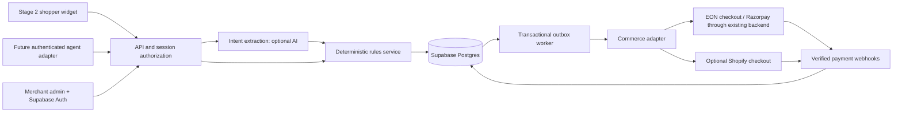

> Historical baseline before 23 September conversion-layer update. Current PRODUCT-SPEC.md and ROADMAP.md take precedence. Retained for implementation reference.

# Architecture and enforcement

Use JavaScript ES modules and Vercel Node functions for HTTP; a small frontend now and optionally React when the dashboard warrants it. Supabase provides Postgres, merchant auth and durable data. Scheduled workers consume outbox jobs; never rely on a response finishing while an unawaited background promise continues. GitHub hosts source and CI. Keep business logic framework independent.

## Boundaries

`rules.decide()` is pure and synchronous. Inputs come only from verified server catalog, immutable policy version and persisted session. Money is integer minor units; currency is explicit. Lower bound = max(merchant floor, ceil(current price × (1 − discount cap))). Merchant floor must already account for tax, payment costs and minimum margin on a documented basis. A later cost model can calculate it, but missing cost approval blocks activation.

Current schedule allows 4%, 7%, 10% concessions across rounds, each clamped to floor/cap. Customer target at or above threshold is accepted at that target, capped at retail. Otherwise issue threshold counteroffer. Floor and policy never appear in the public response or model prompt. Pause, expired session, depleted stock or exhausted rounds deny further negotiation. An offer is a quote; buyer acceptance is a separate operation. Expiry does not renew each turn. One active quote per session; supersede older quotes.

AI port: `extractIntent({message, publicProduct}) → {intent, targetPaise, currency, confidence}`. Validate against strict JSON schema, length/token limits and price/currency constraints. Low confidence, multiple prices or ambiguity returns a clarification. Unsupported currency is not silently converted. The model has no SQL, policy editor, payments or arbitrary URL tools. Render the monetary offer and conditions from engine output using templates; model prose cannot inject a second price or free-shipping promise. Use a short provider timeout and deterministic numeric fallback. Evaluate malicious prompts, multilingual numbers and hallucinated benefits before enabling. The scaffold now includes an OpenAI Responses provider adapter and conversation service with explicit confirmation of inferred prices; it has mocked tests but has not been live-evaluated.

Commerce port: `getVariant`, `validateCart`, `createCheckout({offerId, variantId, quantity, amountPaise, currency, idempotencyKey})`, `getCheckout`, `verifyWebhook`, `cancelQuote`. EON adapter should call its existing server backend so inventory, tax, payment and fulfillment remain authoritative. No browser-submitted payment amount is trusted. Confirm actual Razorpay order flow during discovery. Shopify is optional, using restricted discount primitives only after proving variant/quantity/customer/expiry/non-stacking enforcement. A random one-use code alone is not adequate buyer binding.

## Durable transactions (next implementation)

1. Start: authenticate merchant context and short-lived shopper capability; allocate cryptographically random token, store only its hash, bind tenant/variant/quantity/currency and expiry. Persist stable experiment arm. Server resolves tenant from installed integration; never trust a supplied tenant ID alone.
2. Turn: transaction locks session; validates owner, active state, expiry and current kill switch; loads policy/catalog; checks freshness; increments round and writes quote plus audit event atomically. Quote policy snapshot remains immutable; policy tightening can revoke outstanding quotes explicitly.
3. Accept: transaction locks session, selected current offer and daily merchant budget row in consistent order. Check identity, expiry, quote version, current stock/price/cart, one redemption and current policy revocation. Reserve discount amount within budget; create pending redemption and unique outbox job. Return 202. Concurrent requests must converge on one redemption.
4. Worker: use stable provider idempotency key = redemption ID. Reconcile uncertain provider timeouts before retrying. Save checkout result and emit event. On permanent failure release reserved budget and revoke quote; do not create a second payment order blindly.
5. Payment: verify signature over raw bytes, validate provider account and amount/currency/order mapping, dedupe event; lock redemption and transition once. Move reserved subsidy to spent. Handle delayed/out-of-order events and refunds via explicit transitions and reconciliation. Payment after quote expiry follows the provider order's documented validity; expiry must be enforced by checkout or order invalidation, not merely UI text.

Use Postgres RPC transactions or a single database transaction; multiple REST inserts are not atomic. SQL scaffold deliberately contains no incomplete public mutation RPC. Implement these with tests before enabling Vercel endpoints.

## Schema map

See `supabase/migrations/001_initial.sql` for executable initial DDL. Merchants own memberships, products, immutable policy versions, sessions, offers, redemptions and events. Composite tenant foreign keys prevent cross-merchant relationships. Idempotency keys scope request/response hashes by tenant/principal/route. Budget days hold reservation/spend counters. Webhook receipts deduplicate provider events; outbox handles durable work. Memberships refer to Supabase Auth user IDs.

RLS enabled on every table. Authenticated merchant members can read their own tenant rows; only their own membership row is visible. No anonymous table reads/writes, no direct client writes and no public access to floors. Service-role access is server-only and bypasses RLS, so each backend operation must enforce membership/role/tenant independently. Planned owner policy edits require server authorization and append-only audit. Initial schema allows all members to read policy data; split analyst visibility if EON requires it. Do not expose service key via public environment prefixes.

## Guardrails and threat cases

- Price/cart tampering: resolve trusted catalog, bind variant, quantity=1 and currency; verify exact totals again at acceptance and payment.
- Replay/concurrency: idempotency request hash mismatch → 409; row locks, unique acceptance/redemption and provider-side idempotency.
- Abuse: distributed limits per merchant/session/pseudonymous customer and short-lived IP hash; per-visitor daily negotiation cap and cooldown; challenges only on suspicious bursts. Restarting sessions cannot reset a production allowance. Demo restart intentionally can.
- Budget: reserve atomically before checkout; include in-flight reservations in daily cap; release on expiry/failure through reconciliation; merchant timezone defines budget day.
- Stale data/provider outage: fail closed; suggest normal checkout. Proposed catalog freshness maximum 5 minutes plus fresh validation at acceptance, tuned to EON's inventory feed.
- Web safety: allowlisted embed origins, signed bootstrap, CSRF defenses for cookie routes, restrictive CSP, bounded bodies and sanitized text. CORS is not authorization. Merchant auth verified server-side; least-privilege roles.
- Privacy: no protected traits, wealth inference or sensitive profiling in pricing. No raw chat in analytics by default. Proposed 30-day redacted diagnostic retention and 90-day pseudonymous event retention; agree operational/legal retention for financial records separately. Deletion job and user deletion path before launch. Never collect card details.
- Operations: tenant kill switch; secrets rotation; immutable policy audit; alerts for blocked floors, failed checkouts and webhook backlog. Never claim a timer expires unless the backend enforces it.

## Stage 3 extension

Keep `channel` and authenticated actor metadata separate from pricing. An agent adapter maps a partner's supported protocol to the same start/quote/accept service. Add scoped credentials, delegated user consent, buyer intent limits, signed receipts, rate quotas and protocol/version negotiation. Read-only discovery must not authorize buying. Agents receive no private floors or costs.

UCP and ACP are relevant commerce protocol references, not proof of a universal bargaining standard or automatic ChatGPT integration. Product listing, ads/discovery, negotiation, and checkout are distinct capabilities. Validate a concrete negotiation extension with a partner before claiming support. Website pings are ordinary authenticated HTTP requests, not notifications that require the merchant to manually reply.

Sources checked 2026-09-21: [EON](https://www.houseofeon.in/), [Supabase RLS](https://supabase.com/docs/guides/database/postgres/row-level-security), [Shopify discounts](https://shopify.dev/docs/apps/build/discounts), [Shopify cart code applicability](https://shopify.dev/docs/api/storefront/latest/mutations/cartDiscountCodesUpdate), [UCP](https://ucp.dev/), [ACP](https://www.agenticcommerce.dev/).
